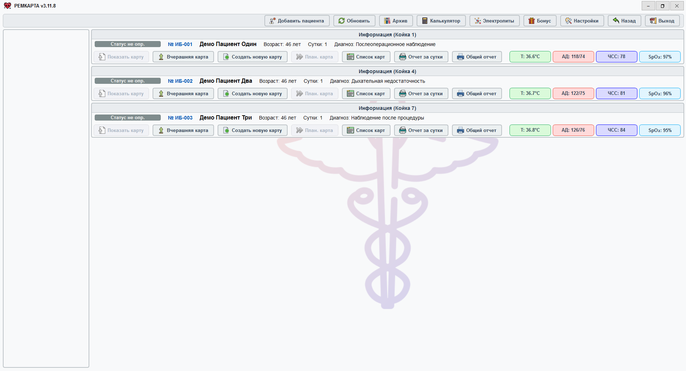
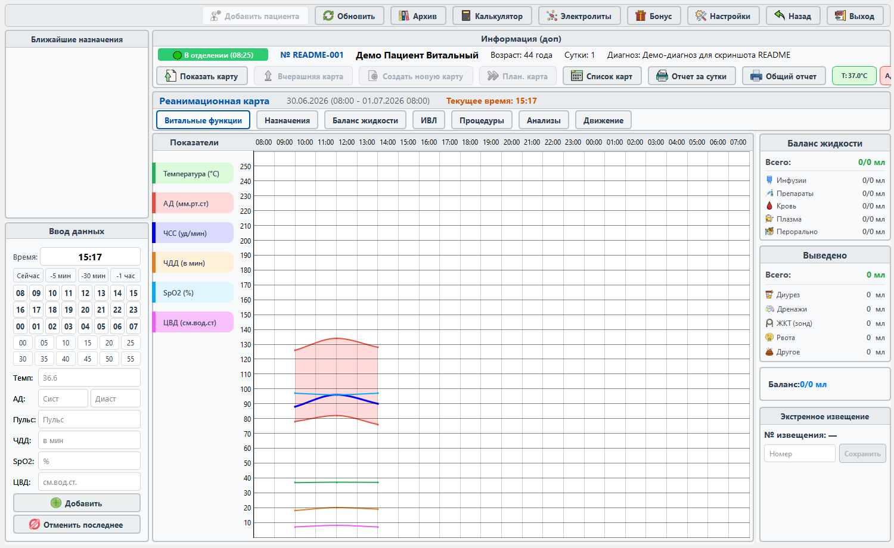
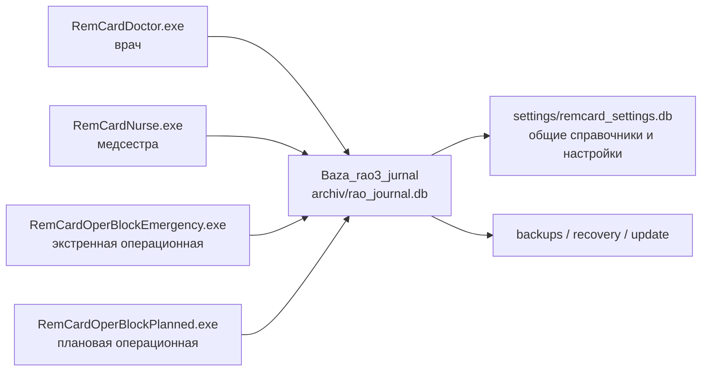

<p align="center">
  
</p>

<h1 align="center">Рем Карта</h1>

<p align="center">
  Desktop-приложение для ведения реанимационной карты пациента, сменной работы врача/медсестры и рабочих мест оперблока.
</p>

<p align="center">
  
  
  
  
  
</p>

> Важно: это не медицинское изделие, не эталон архитектуры и не пример production-grade разработки. Проект требует проверки, аудита и ответственности перед любым реальным использованием.

## Скриншоты

Изображения ниже - реальные скриншоты из программы. Они сняты с текущего UI на временных демо-базах с тестовыми данными, поэтому не содержат реальных пациентов, диагнозов, назначений или медицинских записей.

Главный экран RemCard со списком активных пациентов:



Открытая карта пациента на вкладке витальных функций с заполненным графиком:



## Что это такое

`Рем Карта` - локальное desktop-приложение для отделения реанимации/интенсивной терапии. Оно помогает вести карту пациента по сменам: хранить витальные показатели, назначения, выполнения, баланс жидкости, питание, ИВЛ, события, процедуры, исходы, печатные формы и архив.

Отдельно в проекте есть рабочие места оперблока: экстренная и плановая операционные, быстрые назначения, таймлайн операции, печать и локальный/offline fallback на случай проблем с сетью.

## Зачем оно нужно

Проект появился как попытка заменить разрозненные бумажные/табличные процессы одним рабочим инструментом:

- врач видит активных пациентов, открывает карту, назначает лечение и печатает отчеты;
- медсестра видит назначения, отмечает выполнения и ведет сменную динамику;
- оперблок ведет активные случаи, препараты, события и завершение операции;
- данные врача и медсестры синхронизируются через общую SQLite-БД в сетевой папке;
- приложение старается не показывать "сохранено" до реального commit в БД.

## Как работает



Ключевая идея: несколько клиентов работают с одной сетевой папкой `Baza_rao3_jurnal`. Основная медицинская БД лежит в `archiv/rao_journal.db`, общие настройки и справочники - в `settings/remcard_settings.db`.

Для сетевой SQLite-БД проект жестко держит безопасный профиль:

- `journal_mode=DELETE`;
- `synchronous=EXTRA`;
- `mmap_size=0`;
- запись через lock, очередь и транзакции;
- backup через SQLite Backup API, а не копирование живого файла.

## Что внутри

- Карта пациента по сменам.
- W1-экран коек и активных госпитализаций.
- Назначения и выполнения назначений.
- Витальные показатели, баланс, питание, ИВЛ.
- Процедуры, события, исходы, архив.
- PDF/HTML-отчеты и печатные формы.
- Оперблок: экстренная и плановая операционные.
- Центральная settings DB для справочников, тем, фонов и настроек.
- Автообновление full/patch-пакетами.
- Аварийный режим и offline-сценарии для части workflow.

## Честно о качестве

Этот репозиторий - полностью вайбкод-проект.

Создатель проекта вообще не владеет ни одним языком программирования; это его первый проект. Большая часть решений рождалась через итерации с AI, быстрые правки, эксперименты и попытки заставить задачу работать здесь и сейчас.

Проект начинался в VS Code + Cline на Gemini 3.1. Позже, после постоянных ошибок запуска, сломанных итераций и усталости от ручного разгребания проблем, дальнейшая разработка переехала в Codex-приложение и ChatGPT-чат.

Поэтому проект может содержать и, скорее всего, содержит:

- большое количество костылей;
- архитектурные компромиссы;
- дублирование логики;
- странные участки кода;
- устаревшие compatibility paths;
- ошибки, которые еще не найдены;
- решения, которые опытный разработчик сделал бы иначе.

При этом в проекте уже есть много защитных механизмов: regression checks, architecture checks, backup/restore-drill, update-регламенты, блокировка старых клиентов и документация по критичным инвариантам БД.

## Документация

Начинать лучше отсюда:

- [docs/README.md](docs/README.md) - карта документации.
- [docs/db_safety_contract.md](docs/db_safety_contract.md) - правила безопасности БД.
- [docs/versioning.md](docs/versioning.md) - версии, changelog и релизы.
- [docs/auto_update.md](docs/auto_update.md) - full/patch автообновление.
- [docs/operational_acceptance.md](docs/operational_acceptance.md) - приемочные проверки.
- [docs/project_checkpoint/00_MASTER_CONTEXT_FOR_CHATGPT.md](docs/project_checkpoint/00_MASTER_CONTEXT_FOR_CHATGPT.md) - большой архитектурный снимок.

## Связь

Если проект заинтересовал, можно написать на [menfise@mail.ru](mailto:menfise@mail.ru) с темой письма `РЕМ КАРТА`. Я с радостью расскажу, как это творение работает.

Если вы точно разбираетесь в таких проектах, нашли ошибки или знаете, как помочь отечественному здравоохранению, а конкретно нашему отделению реанимации, ускорить это творение, оптимизировать работу и при этом не сломать логику, я тоже буду рад помощи.

## Проверки

Минимальные команды, которые часто используются перед релизом или рискованными изменениями:

```powershell
python -m compileall app data services ui scripts
python scripts\architecture_safety_check.py
python scripts\regression_safety_checks.py
python scripts\code_quality_checks.py
python scripts\style_audit_check.py
python scripts\network_acceptance_runner.py --operations 24 --benchmark-clicks 3
python scripts\validate_backups.py --max-files 20 --move-invalid
python scripts\restore_drill.py --max-files 20 --cleanup-restored
```

Для документационных изменений тяжелые проверки обычно не нужны; достаточно `git diff --check` и визуальной проверки Markdown.

## Текущий статус

Проект живой и меняется. Основная ветка: `main`.

Стабильность отдельных частей разная: базовые сценарии активно доводятся, но код нельзя считать завершенным или надежным без проверки под конкретную среду. Любые изменения, связанные с БД, миграциями, recovery, update, оперблоком или аварийным режимом, нужно делать особенно осторожно.

## Лицензия и ответственность

Код распространяется под открытой лицензией [MIT](LICENSE).

Создатель проекта не несет никакой ответственности, если у пользователя что-то пошло не так: потерялись данные, сломалась база, приложение повело себя неправильно, были приняты неверные решения или возник любой другой ущерб. Любое использование - строго на свой страх и риск.

Если вы смотрите этот репозиторий как разработчик, относитесь к нему как к большому экспериментальному desktop-проекту, а не как к готовому медицинскому продукту.

Если вы смотрите его как пользователь, не используйте приложение для принятия медицинских решений без независимой проверки, тестирования, резервного процесса и ответственного контроля.
