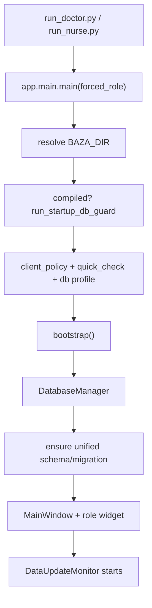
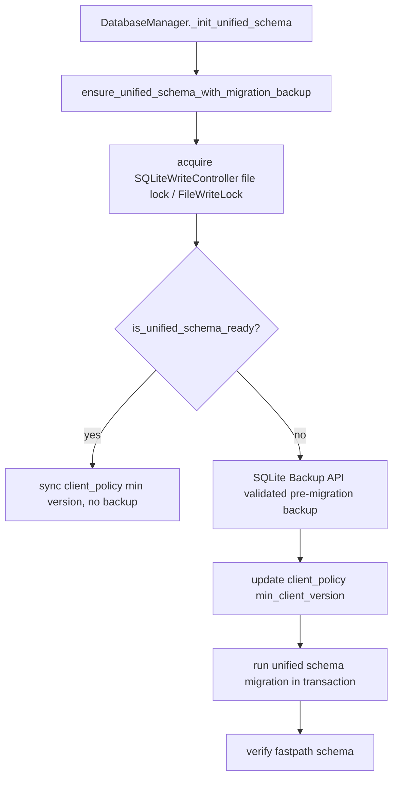
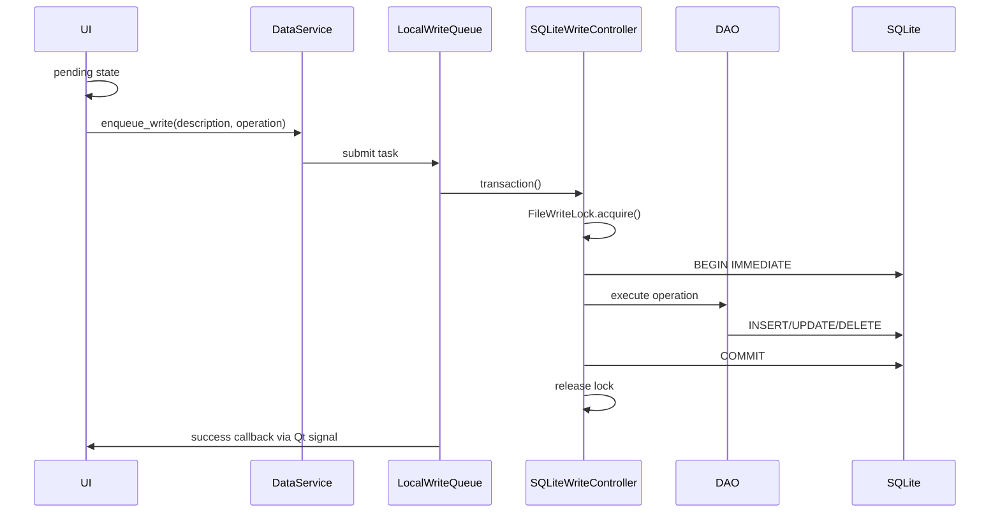
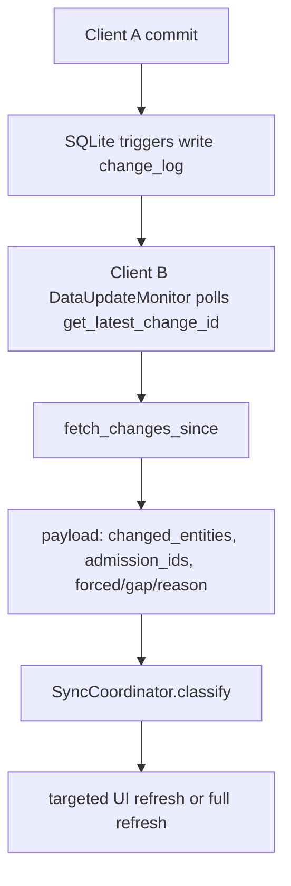
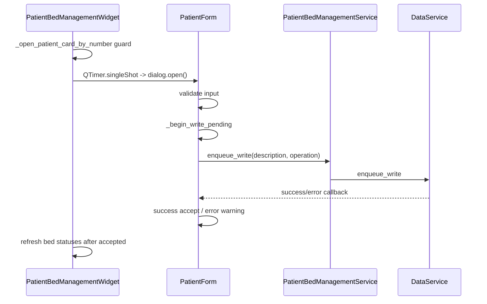

# Data flows

## 1. Startup flow



Ключевые файлы: `run_doctor.py:14-18`, `run_nurse.py:14-18`, `app/main.py:659-850`, `app/bootstrap.py:70-89`, `data/dao/db_manager.py:175-245`.

Ошибки/guards: old client/update (`app/main.py:484-539`), single instance QLocalServer (`app/main.py:659-850`), role lock (`app/main.py:595-619`, `app/role_session_lock.py:15-307`), startup guard (`app/startup_db_guard.py:975-1125`).

## 2. DB validation flow

```text
open readonly SQLite
  → configure_connection(readonly=True)
  → PRAGMA quick_check
  → if needed PRAGMA integrity_check
  → ok / unavailable / locked / corrupt
```

Код: `run_quick_check()` (`app/sqlite_shared.py:152-168`), `run_integrity_check()` (`app/sqlite_shared.py:134-150`), `validate_sqlite_file()` (`app/sqlite_shared.py:395-423`), startup quick check (`app/startup_db_guard.py:441-484`).

Safety: busy/locked/unavailable не равны corruption (`app/startup_db_guard.py:147-171`, `1071-1083`). Confirmed quick_check failure запускает recovery только под locks (`app/startup_db_guard.py:1085-1097`).

## 3. Migration flow



Код: `data/dao/db_manager.py:820-832`, `app/schema_migration_guard.py:88-224`, `app/unified_db_schema.py:1541-1542`.

Ошибки: invalid backup blocks DDL (`app/schema_migration_guard.py:88-104`, regression `scripts/regression_safety_checks.py:1397-1435`); failed migration сохраняет pre-migration backup (`scripts/regression_safety_checks.py:1458-1481`).

## 4. Recovery flow

```text
startup quick_check fails as corruption/missing
  → acquire locks/recovery.lock
  → acquire archiv/db.lock
  → recheck current DB
  → if locked/unavailable: stop, no restore
  → check active other role locks
  → select newest valid backup/snapshot
  → quarantine invalid candidates
  → quarantine current corrupt DB
  → restore temp copy
  → quick_check + integrity_check
  → apply network profile
```

Код: `app/startup_db_guard.py:732-972`, `app/sqlite_shared.py:488-546`.

Safety guards: `recovery.lock`, `db.lock`, active second client protection (`app/startup_db_guard.py:732-758`), invalid backup quarantine (`564-599`), current DB quarantine (`616-646`).

## 5. Write flow



Код: `services/data_service.py:76-113`, `app/sqlite_shared.py:828-949`, `app/sqlite_shared.py:732-810`, `data/dao/db_manager.py:1580-1648`.

Ошибки: rollback on exception (`app/sqlite_shared.py:797-798`), retry busy/locked in queue (`app/sqlite_shared.py:912-949`), conflict exceptions (`services/concurrency.py`, `data/dao/exceptions.py`).

## 6. Read/snapshot flow

```text
UI requests current context
  → ReadCoordinator builds SnapshotContext
  → check in-memory/persistent cache
  → build partial/full snapshot through RemCardService
  → add version/content_hash/dedup_signature
  → UI stale guard checks request_id/admission/date/context
  → UI applies only changed payload
```

Код: `services/read_coordinator.py:39-115`, `412-605`, `607-1079`, `1607-1651`; `services/remcard_facade.py:204-536`; UI apply guards `ui/doctor_view/doctor_remcard_widget.py:627-680`, `ui/nurse_view/nurse_main_widget.py:637-704`.

Ошибки/guards: stale request discard, unchanged snapshot dedupe, persistent cache corrupt file remove (`services/persistent_snapshot_cache.py:67-102`).

## 7. Sync flow between doctor and nurse



Код: `app/unified_db_schema.py:331-419`, `services/data_update_monitor.py:67-189`, `services/sync_coordinator.py:60-96`, `services/data_service.py:164-168`.

Ошибки: cursor moved backwards/empty change rows set forced gap (`services/data_update_monitor.py:89-118`); full refresh reasons in `SyncCoordinator.FULL_REFRESH_REASONS` (`services/sync_coordinator.py:7-13`).

## 8. W1a upcoming orders flow

```text
SectorW1a.refresh_data()
  → AsyncCallThread(loader)
  → RemCardService.build_w1a_upcoming_orders_snapshot()
  → OrderDomainService.get_upcoming_orders_across_active_admissions()
  → SQL over active beds/orders/administrations/status
  → content_hash + change_id
  → SectorW1a applies if content changed
```

Код: `ui/rem_card_sectors/sector_w1a.py:250-308`, `services/remcard_facade.py:1068-1100`, `services/order_domain_service.py:1014-1098`.

Safety: не открывает все карточки; regression check ищет W1a read-model and forbids full-card markers (`scripts/regression_safety_checks.py:7239-7359`).

## 9. PatientForm open/save flow



Код: `ui/patient_bed_management/management_widget.py:165-245`, `ui/patient_bed_management/patient_form.py:230-387`.

Guards: `_is_closing`, `_opening_patient_form`, `_active_patient_form`, stale dialog check, reject ignored while pending (`management_widget.py:64-68`, `207-235`; `patient_form.py:404-449`).

## 10. PDF/analytics/graph worker flow

```text
UI click report/graphs
  → DataCollectorWorker / AnalyticsWorker
  → build data/html off UI thread
  → PdfBuildWorker / HtmlPdfWorker
  → completed signal
  → open PDF / update preview
```

Код: `ui/shared/report_controller.py:43-130`, `144-240`; `ui/shared/pdf_build_worker.py:10-29`; `ui/shared/analytics_worker.py:6-32`; `ui/shared/html_pdf_worker.py:9-40`; `ui/analytics/graphs_dialog.py:287-390`; `services/analytics/graphs_service.py:27-100`.

Guards: worker already running checks, `_closing` checks, cancel on close (`ui/analytics/graphs_dialog.py:287-390`).

## 11. Theme load/apply/save flow

```text
ThemeManager()
  → ThemeStorage.load()
  → if missing/corrupt: default + quarantine broken
  → tokens_for_role()
  → build_global_style()
  → QApplication.setStyleSheet()
  → optional ThemeSettingsDialog save/reset
```

Код: `ui/styles/theme_storage.py:52-118`, `ui/styles/theme_manager.py:17-133`, `ui/styles/qss_builder.py:7-120`, `ui/styles/theme_settings_dialog.py:100-132`, `1085-1105`.

Ошибки: bad JSON -> `*.broken` and defaults (`theme_storage.py:78-118`).

## 12. Shutdown flow

```text
MainWindow.closeEvent
  → role widget shutdown
  → snapshot workers/timers/W1a/orders shutdown
  → DataService.set_shutting_down + shutdown monitor/queue
  → DatabaseManager.close: stop background threads + shutdown backup
  → release role lock
  → optional update check/launch
```

Код: `ui/main_window.py:624-660`, `ui/doctor_view/doctor_remcard_widget.py:2717-2734`, `ui/nurse_view/nurse_main_widget.py:1946-1963`, `services/data_service.py:146-158`, `data/dao/db_manager.py:1872-1895`, `app/main.py:841-850`.

Safety: no late callbacks after `_is_closing`; queue shutdown timeout; role lock release.
